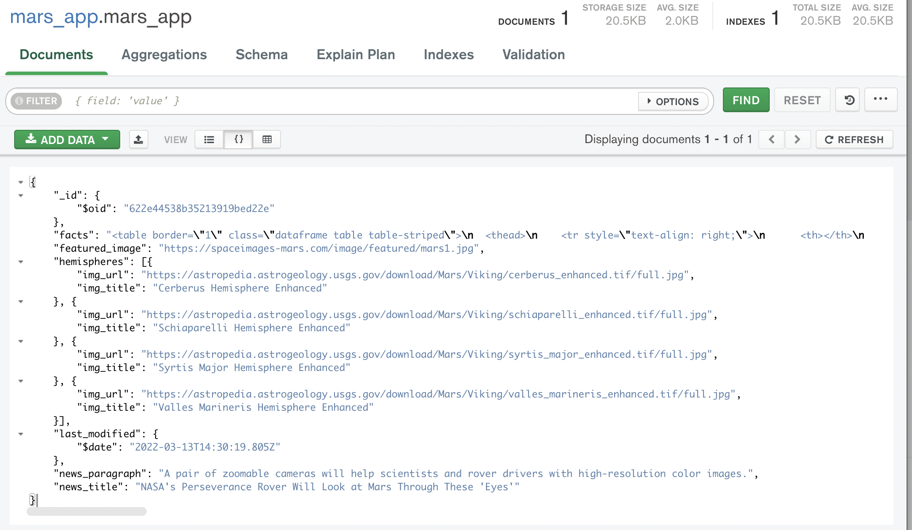

# Mission-to-Mars

## Overview: 

   The purpose of this repository was to scrape data from various websites for information on Mars. This information included text, images, and URLs. To scrape this data, a Python script was used. Afterwards, Flask was used to create a web application with an HTML template file. At the click of a button, the script would scrape the data and store it into a mongoDB database. Within the HTML file, BootStrap was used to present the data in a visually appealing way.

## Results: 

